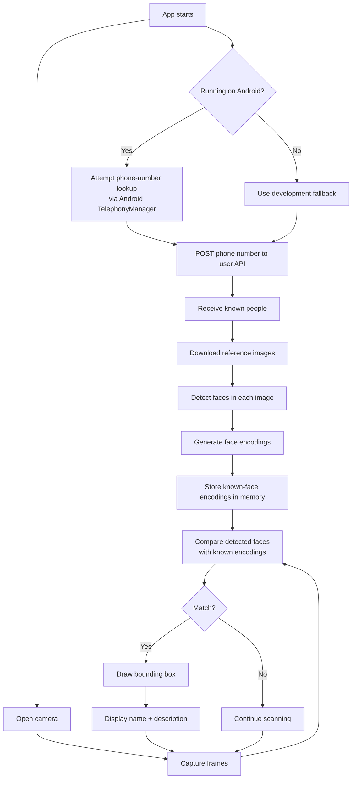
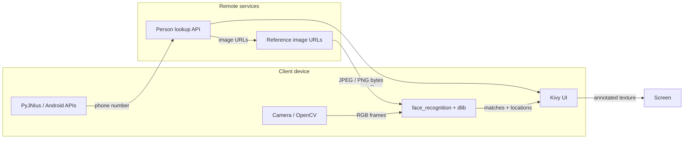
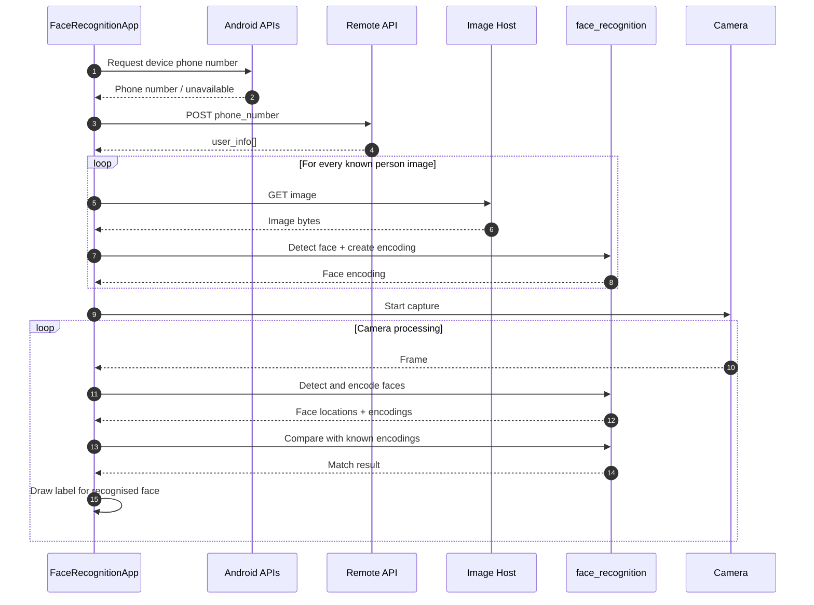
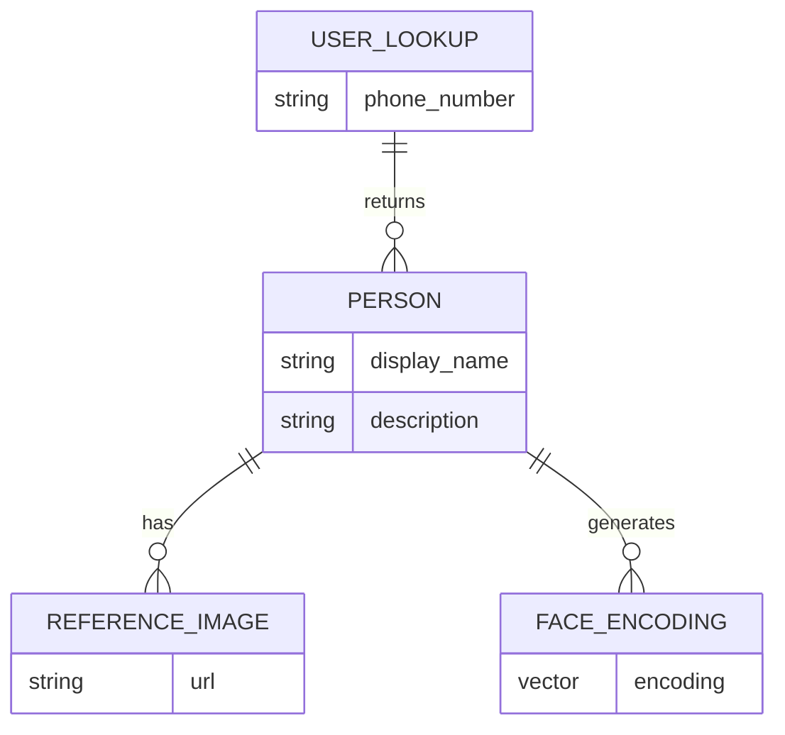
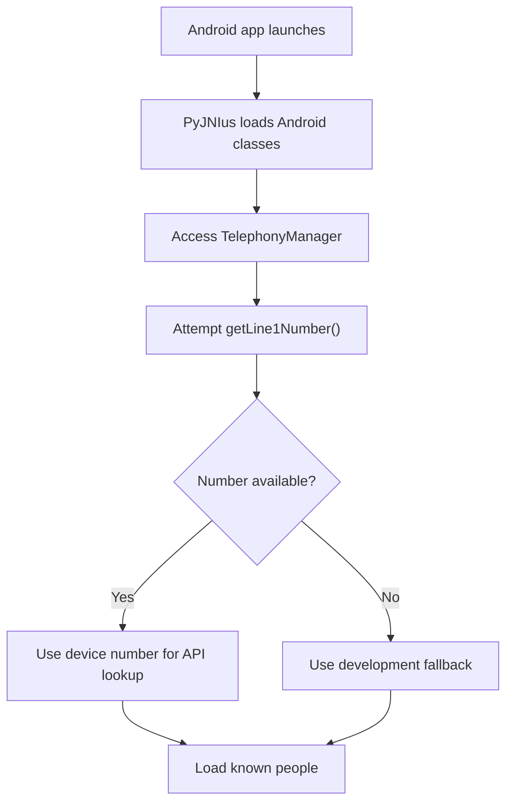
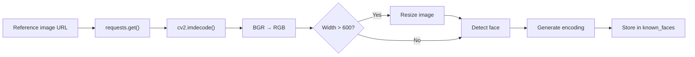
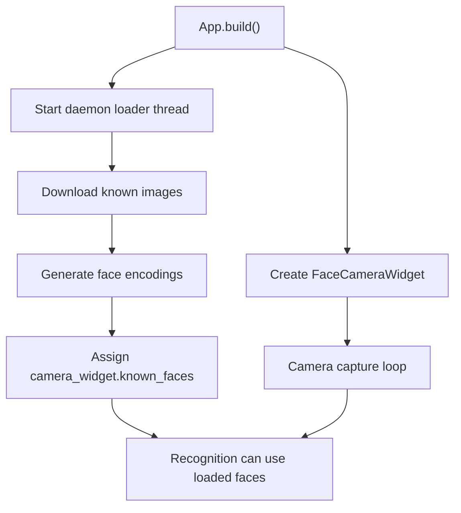
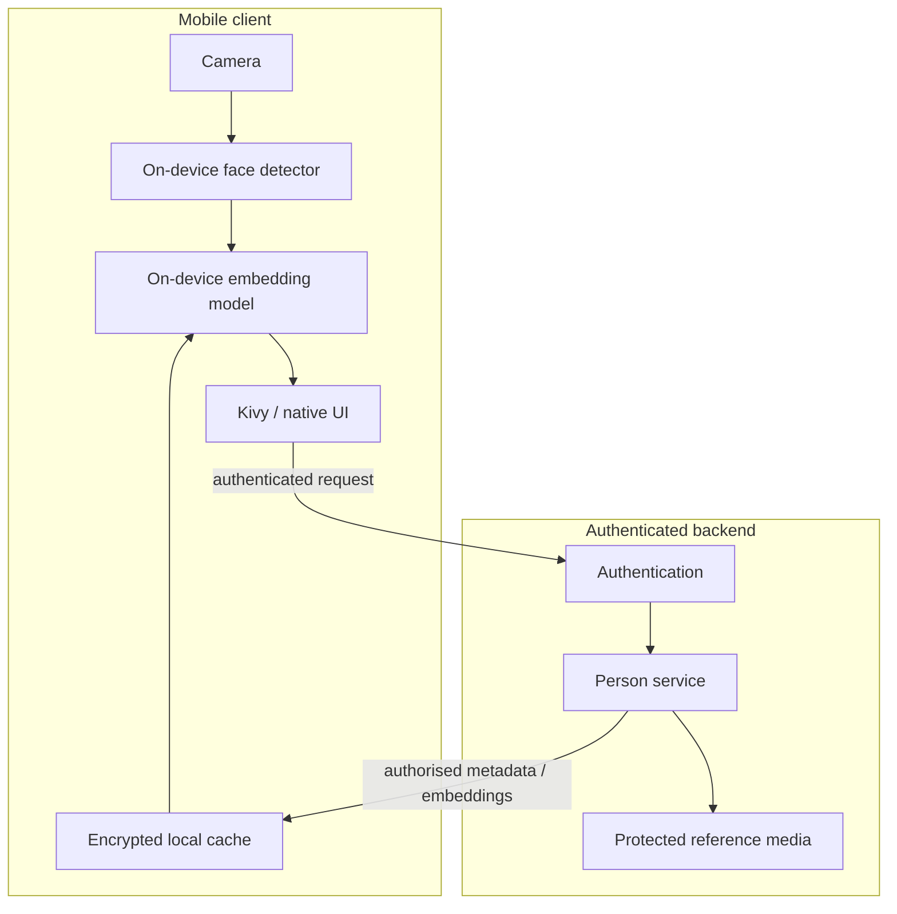
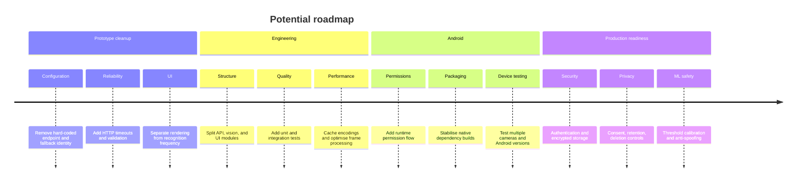

# FaceRecognitionApp

<p align="center">
  <strong>A Python + Kivy prototype for recognising known people from a live camera feed.</strong>
</p>

<p align="center">
  <a href="https://www.python.org/"></a>
  <a href="https://kivy.org/"></a>
  <a href="https://opencv.org/"></a>
  <a href="https://github.com/ageitgey/face_recognition"></a>
  
  
</p>

---

## Overview

**FaceRecognitionApp** is an experimental camera application built with **Kivy**, **OpenCV**, and [`face_recognition`](https://github.com/ageitgey/face_recognition).

At startup, the app identifies the current user via a phone-number lookup, requests a set of known people from a remote API, downloads their reference photos, generates face encodings, and then compares those encodings with faces seen by the device camera.

When a match is found, the app draws a bounding box and displays the person's **name** and **description** over the camera frame.

> [!NOTE]
> This repository is a prototype and is **not yet a production-ready biometric identity system**.

---

## What It Does



---

## Architecture



### Main responsibilities

| Component | Responsibility |
|---|---|
| `get_phone_number()` | Attempts to obtain the Android device phone number |
| `fetch_user_info()` | Requests the people associated with that number |
| `prepare_known_faces()` | Downloads images and generates face encodings |
| `FaceCameraWidget` | Captures frames, performs recognition, and renders overlays |
| `FaceRecognitionApp` | Coordinates startup and background face loading |

---

## Recognition Sequence



---

## Data Model

The app expects the backend to return a `user_info` collection with data shaped approximately like this:

```json
{
  "user_info": [
    {
      "display_name": "Example Person",
      "description": "Example description",
      "images": [
        {
          "url": "https://example.com/reference-image.jpg"
        }
      ]
    }
  ]
}
```

Each usable reference image is converted into a face encoding and associated with that person's name and description.



---

## Repository Structure

```text
faceapp_python/
├── main.py             # Application and recognition pipeline
├── requirements.txt    # Desktop/development Python dependencies
├── buildozer.spec      # Experimental Android packaging configuration
├── README.md
└── readme.txt
```

---

## Tech Stack

| Area | Technology |
|---|---|
| Language | Python |
| UI | Kivy |
| Camera / image processing | OpenCV |
| Face detection / embeddings | `face_recognition` + dlib |
| Numerical processing | NumPy |
| HTTP | Requests |
| Android bridge | PyJNIus |
| Android packaging | Buildozer / python-for-android |

---

## Quick Start

### 1. Clone the repository

```bash
git clone https://github.com/Ultraviolet-Chikorita/faceapp_python.git
cd faceapp_python
```

### 2. Create a virtual environment

#### Windows

```powershell
python -m venv .venv
.venv\Scripts\activate
```

#### Linux / macOS

```bash
python3 -m venv .venv
source .venv/bin/activate
```

### 3. Install dependencies

```bash
pip install -r requirements.txt
```

> [!WARNING]
> `requirements.txt` currently includes Windows-specific packages such as `pywin32`, `pypiwin32`, and Kivy Windows dependencies. It should not yet be treated as a fully cross-platform dependency file.

`dlib` can also require native build tools and CMake, depending on the platform and Python version.

### 4. Run the app

```bash
python main.py
```

The desktop prototype attempts to open camera device `0`.

---

## Android Build

The repository includes an experimental `buildozer.spec`.

The current package configuration uses:

```ini
title = FaceRecognitionApp
package.name = facerecognition
version = 0.1
orientation = portrait
fullscreen = 1
```

Declared Android permissions:

```text
INTERNET
CAMERA
READ_PHONE_STATE
```

A typical Buildozer command is:

```bash
buildozer android debug
```

> [!IMPORTANT]
> Android packaging is currently experimental. Native dependencies such as **dlib**, `face_recognition`, and OpenCV can require additional recipes or build changes under python-for-android.

### Android-specific startup



Phone-number retrieval is not guaranteed to work on every device, SIM, carrier, or Android version. Modern Android versions can impose additional restrictions beyond the permission declared in `buildozer.spec`.

---

## Recognition Details

The matching call currently uses a tolerance of:

```python
face_recognition.compare_faces(
    person["encodings"],
    face_encoding,
    tolerance=0.3,
)
```

A lower tolerance is stricter than the library's typical default and can reduce false positive matches, while potentially increasing false negatives.

### Reference-image preparation

For each remote image, the app:

1. downloads the image with `requests`;
2. decodes it with OpenCV;
3. converts BGR to RGB;
4. reduces very wide images to a maximum width of **600 px**;
5. locates faces;
6. creates an encoding for the first detected face;
7. stores that encoding against the person.



---

## Frame Processing

The Kivy callback is scheduled at approximately **60 callbacks per second**, while the recognition block runs only when:

```python
self.frame_count % 30 == 0
```

So recognition is intentionally skipped on most captured frames.

> [!NOTE]
> In the current implementation, texture rendering also occurs inside that same conditional block. This means the displayed image is updated only on recognition frames rather than on every captured frame.

A useful future refactor would separate:

- **camera rendering** — every frame;
- **face detection / encoding** — periodically;
- **recognition state** — cached between detection runs.

---

## Concurrency

Known-face preparation happens in a daemon thread so downloading and encoding reference images does not block the initial Kivy UI creation.



---

## API Behaviour

The app currently sends a `POST` request to the configured person-by-phone endpoint:

```json
{
  "phone_number": "+44..."
}
```

and expects `user_info` in the JSON response.

The API URL and fallback identity are currently defined directly in `main.py`.

For a production implementation, move configuration into environment variables or a dedicated configuration layer, for example:

```text
FACEAPP_API_URL=
FACEAPP_API_TOKEN=
```

---

## Current Limitations

| Area | Current behaviour | Suggested improvement |
|---|---|---|
| Configuration | API endpoint is hard-coded | Environment/config file |
| Identity | Development fallback phone number is hard-coded | Explicit login/device identity |
| Authentication | No API authentication is shown | Authenticated requests |
| HTTP | Requests have no explicit timeout | Timeouts + retry policy |
| Caching | Reference images/encodings rebuild at startup | Local encrypted cache |
| Matching | Fixed `0.3` tolerance | Configurable/calibrated threshold |
| Unknown people | No explicit `Unknown` label | Add unknown state |
| Reference images | First detected face is encoded | Validate one intended face per image |
| Camera | Device `0` is assumed | Camera selection/configuration |
| Rendering | Display updates inside recognition interval | Render continuously, recognise periodically |
| Android | Native ML dependencies may be difficult to package | Android-compatible inference stack |
| Permissions | Basic permission declaration only | Runtime permission handling |
| Logging | Extensive `print()` debugging | Structured logging |
| Tests | No automated tests | Unit + integration tests |

---

## Privacy & Security

Facial recognition processes biometric information and should be treated as sensitive functionality.

Before using this system beyond experimentation, consider:

- obtaining clear consent from people whose images are processed;
- documenting the purpose and lawful basis for biometric processing;
- authenticating and encrypting API traffic;
- limiting access to reference images;
- avoiding unnecessary retention of raw photographs;
- protecting derived face embeddings;
- implementing deletion and retention controls;
- removing development fallback identities;
- minimising collection of phone numbers and device identifiers;
- performing a privacy/security review before deployment.

> [!CAUTION]
> Do not treat the current prototype as an authentication or access-control system without substantial security, privacy, reliability, and anti-spoofing work.

---

## Suggested Production Architecture



Possible longer-term improvements include moving recognition entirely on-device, returning precomputed embeddings instead of raw reference images, and avoiding phone-number-based identity where possible.

---

## Development Roadmap



---

## Suggested Project Layout

As the prototype grows, the single-file application could be split into something like:

```text
faceapp_python/
├── app/
│   ├── api.py
│   ├── camera.py
│   ├── config.py
│   ├── recognition.py
│   └── ui.py
├── tests/
│   ├── test_api.py
│   └── test_recognition.py
├── main.py
├── requirements.txt
├── requirements-android.txt
├── buildozer.spec
└── README.md
```

---

## Contributing

This is currently an experimental project, but contributions can focus on:

- improving Android compatibility;
- separating application concerns;
- recognition performance;
- API robustness;
- test coverage;
- privacy and security hardening.

A typical contribution workflow:

```bash
git checkout -b feature/my-change
git add .
git commit -m "Describe the change"
git push origin feature/my-change
```

Then open a pull request against `main`.

---

## License

No licence is currently included in the repository.

If this project is intended to be open source, add a `LICENSE` file and update this section with the selected licence.

---

<p align="center">
  <sub>Experimental face-recognition prototype built with Python, Kivy, OpenCV, and dlib.</sub>
</p>
