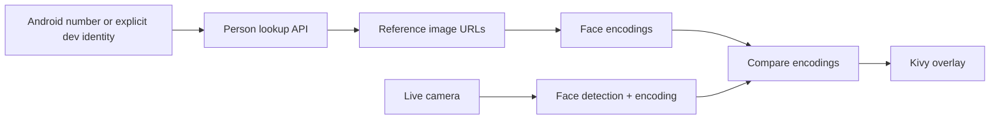

# FaceRecognitionApp

A Python/Kivy prototype for recognising a small set of known people from a live camera feed using OpenCV and `face_recognition`/dlib.

> **Status:** experimental biometric prototype. It is **not** an authentication system and is not production-ready. The main value of the repository is the end-to-end client flow: identity lookup, remote reference-image loading, face encoding, live camera matching, and UI overlays.

## What it does

1. On supported Android devices, attempts to obtain the current device phone number through `TelephonyManager`.
2. For desktop development, an identity can be supplied explicitly through `REMIND_DEV_PHONE_NUMBER`.
3. Calls a configurable person-lookup API.
4. Downloads reference images for known people.
5. Generates face encodings in a background thread.
6. Periodically detects and matches faces from camera device `0`.
7. Draws the matched person's name/description over the camera frame.

No development phone number is embedded in source. If neither Android nor `REMIND_DEV_PHONE_NUMBER` provides an identity, the app simply starts with no known-person records.

## Reviewer guide

This is deliberately a small prototype; almost all behavior is in [`main.py`](main.py). The useful pieces to inspect are:

- `get_phone_number()` - optional Android identity bridge;
- `fetch_user_info()` - API/configuration boundary with timeouts and error handling;
- `prepare_known_faces()` - reference-image download, normalization and encoding;
- `FaceCameraWidget` - live capture, recognition cadence and overlays;
- `FaceRecognitionApp` - UI lifecycle and background loading.

[`buildozer.spec`](buildozer.spec) contains the experimental Android packaging configuration.

## Architecture



Reference encodings are held in memory for the session. The current matching tolerance is intentionally strict (`0.3`) but has **not** been calibrated on a representative benchmark.

## Configuration

The prototype supports these environment variables:

```text
REMIND_API_URL=https://.../api/person/by-phone/
REMIND_DEV_PHONE_NUMBER=...   # desktop development only
```

The existing hosted endpoint remains the default API URL for compatibility, but identity is never supplied through a hard-coded fallback.

## Quick start

```bash
python -m venv .venv
# Windows: .venv\Scripts\activate
# Unix/macOS: source .venv/bin/activate
pip install -r requirements.txt
python main.py
```

The desktop path assumes camera device `0`. `dlib`/`face_recognition` may require native build tooling depending on platform and Python version.

## Android

The repository includes an experimental `buildozer.spec` and declares camera/network/phone-state permissions. Android packaging is not guaranteed to work unchanged because native dependencies such as dlib and OpenCV can require custom python-for-android recipes.

A typical development command is:

```bash
buildozer android debug
```

Modern Android versions and carriers may not expose a phone number even when permission is granted, so production identity should not depend on `getLine1Number()`.

## Privacy and security

Facial recognition and phone-number lookup involve sensitive personal data. Before any deployment beyond a controlled prototype, the design would need at least:

- explicit consent and a documented purpose for biometric processing;
- authenticated API access;
- strict retention/deletion controls for images and embeddings;
- encrypted local storage if encodings are cached;
- anti-spoofing/liveness protection if recognition influences consequential actions;
- calibrated false-positive/false-negative thresholds;
- an identity mechanism that does not depend on a phone number exposed by the OS;
- a privacy/security review covering the backend as well as the client.

Do not use the current prototype for access control, authentication, surveillance, or other high-stakes identity decisions.

## Current limitations

- single-file architecture;
- no automated test suite;
- fixed camera selection;
- fixed, uncalibrated match threshold;
- first detected face in each reference image is used;
- no liveness detection;
- session-only in-memory encodings;
- periodic recognition rather than a decoupled render/detection pipeline;
- experimental Android packaging.

## Best next engineering work

I would split API, configuration, recognition and UI concerns into separate modules; add deterministic tests around API parsing and match selection; separate camera rendering from the slower detection cadence; and build a consent-aware local cache that stores derived embeddings rather than repeatedly downloading raw reference images.
